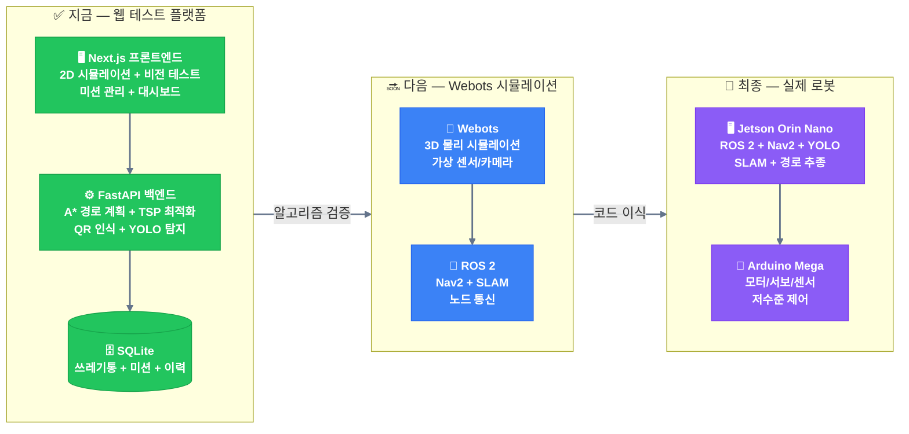
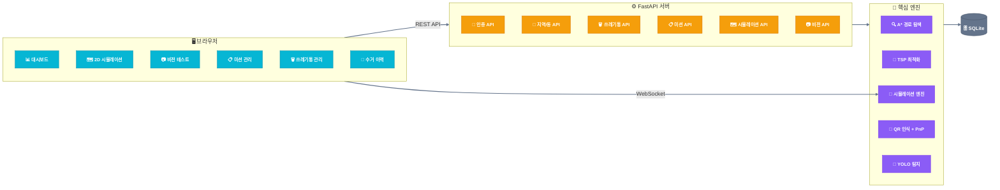
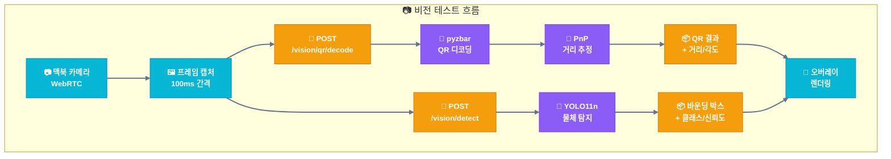
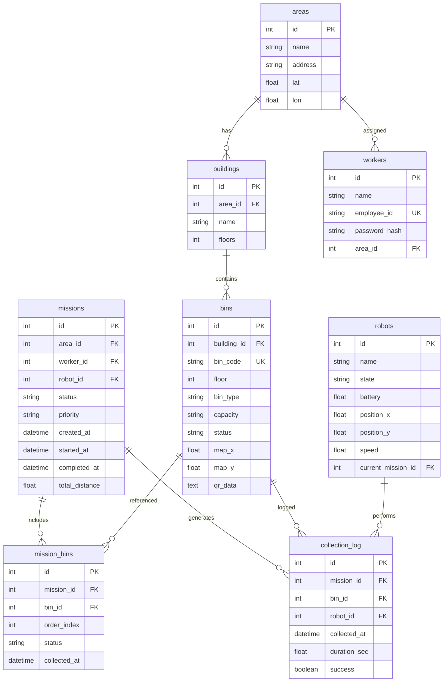
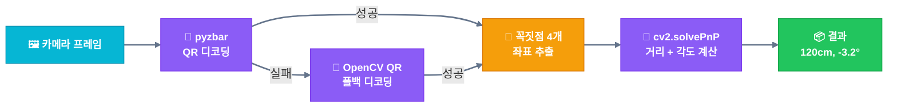
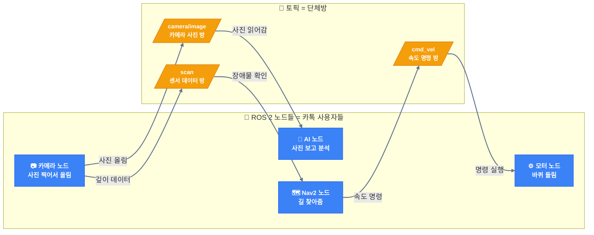
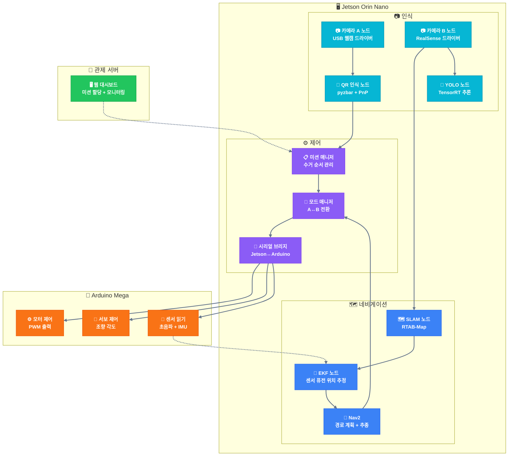

# 자율주행 음식물쓰레기통 수거 로봇 — 소프트웨어 설계 명세서

> **프로젝트명**: AI+X 기계설계 — 자율주행 음식물쓰레기통 수거 로봇
> **문서 유형**: 개발자 가이드 (코드 구조 + API + 실행법 + ROS 2 가이드)
> **버전**: v0.1.0
> **작성일**: 2026-03-14

---

## 목차

1. [소프트웨어 전체 구조](#1-소프트웨어-전체-구조)
2. [기술 스택](#2-기술-스택)
3. [웹 테스트 플랫폼 — 프로젝트 구조](#3-웹-테스트-플랫폼--프로젝트-구조)
4. [DB 스키마](#4-db-스키마)
5. [API 명세](#5-api-명세)
6. [핵심 알고리즘](#6-핵심-알고리즘)
7. [실행 가이드](#7-실행-가이드)
8. [ROS 2 가이드 — PM을 위한 개념 설명](#8-ros-2-가이드--pm을-위한-개념-설명)
9. [Webots 시뮬레이션 로드맵](#9-webots-시뮬레이션-로드맵)
10. [개발 로드맵](#10-개발-로드맵)

---
이상윤 멋쟁이

## 1. 소프트웨어 전체 구조

### 1.1 3단계 소프트웨어 레이어



**핵심 포인트**: 웹에서 검증한 알고리즘(A*, TSP, QR, YOLO)이 Webots → 실제 로봇으로 **그대로 이식**됩니다. 센서 입력만 바뀔 뿐 로직은 동일합니다.

### 1.2 웹 테스트 플랫폼 아키텍처



---

## 2. 기술 스택

### 2.1 현재 (웹 테스트 플랫폼)

| 영역 | 기술 | 버전 | 역할 |
|------|------|------|------|
| **프론트엔드** | Next.js (App Router) | 16.x | SSR + React 기반 UI |
| **UI 스타일** | Tailwind CSS | 4.x | 유틸리티 기반 CSS |
| **언어** | TypeScript | latest | 타입 안전성 |
| **차트** | Recharts | 3.8 | 통계 시각화 (대시보드) |
| **백엔드** | FastAPI | 0.115 | 비동기 REST API + WebSocket |
| **ORM** | SQLAlchemy | 2.0 | 비동기 DB 접근 |
| **DB** | SQLite + aiosqlite | - | 로컬 파일 DB (설치 불필요) |
| **인증** | JWT (python-jose) | - | 토큰 기반 인증 |
| **비전** | OpenCV + pyzbar | 4.10 | QR 디코딩 + 이미지 처리 |
| **AI** | ultralytics (YOLO) | 8.3 | 물체 탐지 (사전학습 모델) |
| **QR 생성** | qrcode[pil] | 8.0 | QR 코드 PNG 생성 |
| **실시간** | WebSocket (내장) | - | 시뮬레이션 위치 스트리밍 |

### 2.2 다음 단계 (추가 예정)

| 영역 | 기술 | 역할 |
|------|------|------|
| **3D 시뮬레이션** | Webots | 물리 기반 로봇 시뮬레이션 |
| **로봇 미들웨어** | ROS 2 Humble | 노드 간 통신 + Nav2 |
| **SLAM** | RTAB-Map | 실시간 맵 생성 + 위치 추정 |
| **네비게이션** | Nav2 | 경로 계획 + 장애물 회피 |
| **연동** | webots_ros2 | Webots ↔ ROS 2 브리지 |

---

## 3. 웹 테스트 플랫폼 — 프로젝트 구조

### 3.1 디렉토리 트리

```
autoproject/
├── CLAUDE.md                          # 프로젝트 문서
├── 하드웨어_설계_명세서.md              # 하드웨어 스펙
├── 소프트웨어_설계_명세서.md            # 이 문서
│
├── backend/                           # Python FastAPI
│   ├── main.py                        # 앱 진입점 + WebSocket 핸들러
│   ├── config.py                      # DB URL, JWT 설정, CORS
│   ├── database.py                    # SQLAlchemy 엔진 + 세션
│   ├── models.py                      # 8개 ORM 모델
│   ├── schemas.py                     # Pydantic 요청/응답 스키마
│   ├── seed_data.py                   # 테스트 데이터 시딩
│   ├── websocket_manager.py           # 채널 기반 WS 연결 관리
│   ├── requirements.txt               # Python 의존성 (14개)
│   ├── routers/
│   │   ├── auth.py                    # POST /api/auth/login
│   │   ├── areas.py                   # GET /api/areas, /areas/{id}/buildings
│   │   ├── bins.py                    # CRUD /api/bins
│   │   ├── missions.py                # CRUD /api/missions + start/cancel
│   │   ├── robots.py                  # GET /api/robots
│   │   ├── simulation.py              # GET /api/simulation/map, POST /plan
│   │   └── vision.py                  # POST /api/vision/qr/*, /detect
│   ├── services/
│   │   ├── pathfinding.py             # A* 알고리즘 (8방향, 장애물 인플레이션)
│   │   ├── mission_planner.py         # TSP 최근접 이웃 휴리스틱
│   │   └── simulation_engine.py       # 비동기 로봇 이동 시뮬레이션
│   └── vision/
│       ├── qr_generator.py            # QR 코드 PNG 생성
│       ├── qr_reader.py               # pyzbar + OpenCV QR 디코딩
│       ├── yolo_detector.py           # YOLO11n 추론 래퍼
│       └── distance_estimator.py      # PnP 거리/각도 추정
│
└── frontend/                          # Next.js 16 (App Router)
    ├── package.json
    ├── .env.local                     # NEXT_PUBLIC_API_URL=http://localhost:8000
    └── src/
        ├── app/
        │   ├── layout.tsx             # 루트 레이아웃 (Geist 폰트, ko)
        │   ├── page.tsx               # / → /dashboard 또는 /login 리다이렉트
        │   ├── login/page.tsx         # 로그인 페이지
        │   └── (main)/               # 인증 필요 라우트 그룹
        │       ├── layout.tsx         # 사이드바 + 인증 체크
        │       ├── dashboard/page.tsx # 메인 대시보드
        │       ├── simulation/page.tsx # 2D 맵 시뮬레이션
        │       ├── vision/page.tsx    # QR + YOLO 비전 테스트
        │       ├── missions/page.tsx  # 미션 생성/관리
        │       ├── bins/page.tsx      # 쓰레기통 조회/QR 다운로드
        │       └── history/page.tsx   # 수거 이력 + 통계
        ├── components/
        │   └── ui/Sidebar.tsx         # 네비게이션 사이드바
        └── lib/
            ├── api.ts                 # API 호출 래퍼 (JWT 자동 첨부)
            └── types.ts               # TypeScript 인터페이스 (11개)
```

### 3.2 프론트엔드 페이지 구조

| 페이지 | 경로 | 핵심 기능 |
|--------|------|----------|
| **로그인** | `/login` | 직원번호 + 비밀번호 → JWT 토큰 발급, localStorage 저장 |
| **대시보드** | `/dashboard` | 로봇 상태 카드, 활성 미션 수, 완료 통계, 최근 미션 테이블 |
| **2D 시뮬레이션** | `/simulation` | Canvas 맵(70x50), 쓰레기통 클릭 선택, A* 경로 시각화, WebSocket 로봇 애니메이션 |
| **비전 테스트** | `/vision` | 맥북 카메라 WebRTC, QR/YOLO/하이브리드 모드, 바운딩 박스 오버레이, QR 생성기 |
| **미션 관리** | `/missions` | 지역→동→통 선택, 미션 생성, 미션 목록, 시작/취소 |
| **쓰레기통 관리** | `/bins` | 지역/동 필터, 쓰레기통 테이블, 대량 QR 다운로드 |
| **수거 이력** | `/history` | 완료 미션/수거 통/이동거리 통계, 상태별 필터, 이력 테이블 |

### 3.3 백엔드 모듈 구조

| 모듈 | 파일 | 역할 |
|------|------|------|
| **라우터** | `routers/auth.py` | JWT 로그인 (bcrypt 비밀번호 검증) |
| | `routers/areas.py` | 지역/동 조회 (건물 수, 쓰레기통 수 포함) |
| | `routers/bins.py` | 쓰레기통 CRUD (area_id/building_id 필터) |
| | `routers/missions.py` | 미션 CRUD + 시작/취소 (selectinload로 N+1 방지) |
| | `routers/robots.py` | 로봇 상태 조회 |
| | `routers/simulation.py` | 70x50 그리드 맵 + A*/TSP 경로 계획 |
| | `routers/vision.py` | QR 생성/디코딩 + YOLO 탐지 (lazy load) |
| **서비스** | `services/pathfinding.py` | A* 알고리즘 (Nav2 NavFn 미러링) |
| | `services/mission_planner.py` | TSP 최근접 이웃 휴리스틱 |
| | `services/simulation_engine.py` | WebSocket 로봇 위치 브로드캐스트 |
| **비전** | `vision/qr_generator.py` | JSON → QR PNG 생성 |
| | `vision/qr_reader.py` | pyzbar 1차 + OpenCV QR 2차 디코딩 |
| | `vision/yolo_detector.py` | YOLO11n 래퍼 (첫 호출 시 모델 로드) |
| | `vision/distance_estimator.py` | cv2.solvePnP 거리/각도 추정 |

### 3.4 데이터 흐름

```mermaid
flowchart LR
    subgraph 시뮬레이션흐름 ["🗺️ 시뮬레이션 흐름"]
        direction LR
        U1[🖱️ 쓰레기통<br/>클릭 선택]:::user ==> A1[📡 POST<br/>/simulation/plan]:::api
        A1 ==> S1[🔄 TSP 순서<br/>최적화]:::engine
        S1 ==> S2[🔍 A* 경로<br/>계산]:::engine
        S2 ==> R1[📦 경로 데이터<br/>응답]:::api
        R1 ==> C1[🎨 Canvas<br/>경로 렌더링]:::user
        C1 ==> W1[🔌 WebSocket<br/>시뮬 시작]:::ws
        W1 ==> S3[🤖 로봇 이동<br/>100ms 브로드캐스트]:::engine
        S3 ==> C2[🎬 로봇 위치<br/>실시간 애니메이션]:::user
    end

    classDef user fill:#06b6d4,stroke:#0891b2,color:#fff,font-size:13px,font-weight:bold
    classDef api fill:#f59e0b,stroke:#d97706,color:#fff,font-size:13px,font-weight:bold
    classDef engine fill:#8b5cf6,stroke:#7c3aed,color:#fff,font-size:13px,font-weight:bold
    classDef ws fill:#22c55e,stroke:#16a34a,color:#fff,font-size:13px,font-weight:bold

    linkStyle default stroke:#64748b,stroke-width:2px
```





---

## 4. DB 스키마

### 4.1 ER 다이어그램



### 4.2 Enum 값

| Enum | 값 | 설명 |
|------|---|------|
| **MissionStatus** | `pending` | 생성됨, 대기 중 |
| | `in_progress` | 수거 진행 중 |
| | `completed` | 수거 완료 |
| | `cancelled` | 취소됨 |
| | `failed` | 실패 |
| **RobotState** | `idle` | 대기 |
| | `navigating` | 이동 중 |
| | `grasping` | 파지 중 |
| | `returning` | 복귀 중 |
| | `charging` | 충전 중 |
| | `error` | 에러 |
| **BinStatus** | `registered` | 등록됨 |
| | `pending` | 수거 대기 |
| | `collected` | 수거 완료 |

### 4.3 시드 데이터

| 항목 | 수량 | 내용 |
|------|------|------|
| **지역(Area)** | 2 | 레미안 1단지, 힐스테이트 2단지 |
| **동(Building)** | 10 | 단지당 5개 (101~105동, 201~205동) |
| **쓰레기통(Bin)** | 100 | 동당 10개, 맵 좌표 자동 배치 |
| **환경미화원(Worker)** | 2 | ENV-001 (pw: 1234), ENV-002 (pw: 1234) |
| **로봇(Robot)** | 2 | Robot-001, Robot-002 |

---

## 5. API 명세

### 5.1 전체 엔드포인트 목록

| 메서드 | 경로 | 설명 | 인증 |
|--------|------|------|------|
| `GET` | `/api/health` | 서버 상태 확인 | - |
| `POST` | `/api/auth/login` | 로그인 → JWT 토큰 | - |
| `GET` | `/api/areas` | 지역 목록 | - |
| `GET` | `/api/areas/{id}/buildings` | 특정 지역의 동 목록 | - |
| `GET` | `/api/bins?area_id=&building_id=` | 쓰레기통 목록 (필터) | - |
| `POST` | `/api/bins` | 쓰레기통 생성 | - |
| `PUT` | `/api/bins/{id}` | 쓰레기통 수정 | - |
| `DELETE` | `/api/bins/{id}` | 쓰레기통 삭제 | - |
| `GET` | `/api/robots` | 로봇 목록 | - |
| `GET` | `/api/robots/{id}` | 로봇 상세 | - |
| `GET` | `/api/missions?status=` | 미션 목록 (상태 필터) | - |
| `POST` | `/api/missions` | 미션 생성 | - |
| `GET` | `/api/missions/{id}` | 미션 상세 | - |
| `POST` | `/api/missions/{id}/start` | 미션 시작 | - |
| `POST` | `/api/missions/{id}/cancel` | 미션 취소 | - |
| `GET` | `/api/simulation/map` | 시뮬레이션 맵 데이터 | - |
| `POST` | `/api/simulation/plan` | 경로 계획 (A* + TSP) | - |
| `POST` | `/api/vision/qr/generate` | QR 코드 PNG 생성 | - |
| `POST` | `/api/vision/qr/decode` | QR 코드 디코딩 (이미지 업로드) | - |
| `POST` | `/api/vision/detect` | YOLO 물체 탐지 (이미지 업로드) | - |
| `WS` | `/ws/simulation/{mission_id}` | 시뮬레이션 실시간 스트림 | - |

### 5.2 주요 API 요청/응답 예시

#### 로그인

```
POST /api/auth/login
```

```json
// 요청
{ "employee_id": "ENV-001", "password": "1234" }

// 응답
{ "token": "eyJhbGciOiJIUzI1...", "name": "김환경", "area_name": "레미안 1단지" }
```

#### 미션 생성

```
POST /api/missions
```

```json
// 요청
{ "area_id": 1, "bin_ids": [1, 5, 8] }

// 응답
{
  "id": 1,
  "area_id": 1,
  "status": "pending",
  "priority": "normal",
  "created_at": "2026-03-14T10:00:00",
  "total_distance": 0.0,
  "bins": [
    { "id": 1, "bin_id": 1, "bin_code": "101동-01", "order_index": 0, "status": "pending" },
    { "id": 2, "bin_id": 5, "bin_code": "101동-05", "order_index": 1, "status": "pending" },
    { "id": 3, "bin_id": 8, "bin_code": "101동-08", "order_index": 2, "status": "pending" }
  ]
}
```

#### 경로 계획

```
POST /api/simulation/plan
```

```json
// 요청
{ "bin_ids": [1, 5, 8] }

// 응답
{
  "ordered_bin_ids": [1, 5, 8],
  "paths": [
    {
      "from_x": 35.0, "from_y": 0.0,
      "to_x": 5.0, "to_y": 7.0,
      "path": [[35.0, 0.0], [34.0, 1.0], ..., [5.0, 7.0]]
    }
  ],
  "total_distance": 87.5,
  "estimated_time_sec": 184.0
}
```

#### QR 디코딩

```
POST /api/vision/qr/decode  (multipart/form-data, file=이미지)
```

```json
// 응답
{
  "decoded_data": { "bin_code": "101동-01", "type": "food_waste", "capacity": "3L" },
  "corners": [[100, 100], [200, 100], [200, 200], [100, 200]],
  "distance_cm": 120.5,
  "angle_deg": -3.2,
  "success": true
}
```

#### YOLO 탐지

```
POST /api/vision/detect  (multipart/form-data, file=이미지)
```

```json
// 응답
{
  "detections": [
    { "class_name": "person", "confidence": 0.92, "bbox": [100.0, 50.0, 300.0, 400.0] },
    { "class_name": "cup", "confidence": 0.78, "bbox": [350.0, 200.0, 420.0, 350.0] }
  ],
  "inference_time_ms": 45.2
}
```

### 5.3 WebSocket 메시지 포맷

```
WS /ws/simulation/{mission_id}
```

**클라이언트 → 서버:**

```json
{ "action": "start" }   // 시뮬레이션 시작
{ "action": "stop" }    // 시뮬레이션 중지
```

**서버 → 클라이언트 (100ms 간격):**

```json
// 로봇 위치 업데이트
{ "type": "position", "x": 15.2, "y": 8.7, "state": "navigating", "bin_index": 0 }

// 쓰레기통 도착 → 파지 시작
{ "type": "pickup_start", "bin_id": 5, "bin_index": 0, "x": 5.0, "y": 7.0, "state": "grasping" }

// 파지 완료 (3초 후)
{ "type": "pickup_complete", "bin_id": 5, "bin_index": 0, "state": "navigating" }

// 미션 완료 (집하장 복귀 후)
{ "type": "mission_complete", "state": "idle" }
```

---

## 6. 핵심 알고리즘

### 6.1 A* 경로 탐색

| 항목 | 내용 |
|------|------|
| **파일** | `backend/services/pathfinding.py` |
| **입력** | 70x50 그리드 (0=도로, 1=건물), 출발점, 도착점 |
| **출력** | 좌표 리스트 [(x,y), (x,y), ...] |
| **이동 방향** | 8방향 (상하좌우 + 대각선) |
| **대각선 비용** | √2 ≈ 1.414 |
| **휴리스틱** | Octile distance (8방향에 최적) |
| **장애물 인플레이션** | 반경 2셀, 비용 감쇠 — Nav2 InflationLayer와 동일 개념 |
| **특수 처리** | 출발/도착이 장애물 안이면 가장 가까운 빈 셀 탐색 |


**Nav2 대응**: 이 A* 구현은 Nav2의 `NavFn` 플래너와 동일한 개념입니다. 나중에 ROS 2로 전환하면 `NavFn` 또는 `SmacPlanner2D`로 대체됩니다.

### 6.2 TSP 수거 순서 최적화

| 항목 | 내용 |
|------|------|
| **파일** | `backend/services/mission_planner.py` |
| **알고리즘** | 최근접 이웃 (Nearest-Neighbor) 휴리스틱 |
| **입력** | 출발점 좌표 + 쓰레기통 좌표 맵 |
| **출력** | 최적 방문 순서 [bin_id, bin_id, ...] |
| **시간 복잡도** | O(n²) — 쓰레기통 수가 적어서 충분 |

**동작 방식**: 현재 위치에서 가장 가까운 미방문 쓰레기통을 다음 목표로 선택. 모든 쓰레기통을 방문할 때까지 반복.

### 6.3 QR 인식 + PnP 거리 추정

| 항목 | 내용 |
|------|------|
| **QR 디코딩** | `backend/vision/qr_reader.py` |
| **거리 추정** | `backend/vision/distance_estimator.py` |
| **1차 디코더** | pyzbar (libzbar 바인딩) — 빠르고 정확 |
| **2차 디코더** | OpenCV QRCodeDetector — pyzbar 실패 시 폴백 |
| **거리 계산** | cv2.solvePnP() — QR 크기(10x10cm) 기준 PnP |
| **출력** | 거리(cm) + 각도(degree) |



### 6.4 YOLO 물체 탐지

| 항목 | 내용 |
|------|------|
| **파일** | `backend/vision/yolo_detector.py` |
| **모델** | YOLOv11-nano (COCO 사전학습, ~6MB) |
| **로딩** | Lazy load (첫 요청 시 모델 로드) |
| **성능** | MacBook CPU ~5-10 FPS |
| **출력** | 클래스명 + 신뢰도 + 바운딩 박스 [x1,y1,x2,y2] |

**나중에 Jetson Nano에서**: `model.export(format='engine')` → TensorRT FP16 → 30+ FPS

### 6.5 시뮬레이션 엔진

| 항목 | 내용 |
|------|------|
| **파일** | `backend/services/simulation_engine.py` |
| **통신** | WebSocket (채널: `sim-{mission_id}`) |
| **업데이트 주기** | 100ms |
| **파지 시뮬레이션** | 쓰레기통 도착 시 3초 정지 |
| **이벤트** | `position`, `pickup_start`, `pickup_complete`, `mission_complete` |

---

## 7. 실행 가이드

### 7.1 사전 요구사항

| 항목 | 최소 버전 | 확인 명령 |
|------|----------|----------|
| **Python** | 3.11+ | `python3 --version` |
| **Node.js** | 18+ | `node --version` |
| **Homebrew** (macOS) | - | `brew --version` |
| **zbar** (QR 디코딩) | - | `brew install zbar` |

### 7.2 백엔드 설치 + 실행

```bash
# 1. 프로젝트 디렉토리 이동
cd /Users/kyungsbook/Desktop/autoproject

# 2. Python 가상환경 생성
cd backend
python3 -m venv .venv

# 3. 가상환경 활성화
source /Users/kyungsbook/Desktop/autoproject/backend/.venv/bin/activate

# 4. 의존성 설치
pip install -r requirements.txt

# 5. 데이터 디렉토리 생성 (SQLite 파일 저장)
mkdir -p data

# 6. 시드 데이터 생성
python seed_data.py

# 7. 서버 실행
uvicorn main:app --reload --host 0.0.0.0 --port 8000
```

**성공 시**: `http://localhost:8000/api/docs` 에서 Swagger UI 확인

### 7.3 프론트엔드 설치 + 실행

```bash
# 1. 프론트엔드 디렉토리 이동
cd /Users/kyungsbook/Desktop/autoproject/frontend

# 2. 의존성 설치
npm install

# 3. 개발 서버 실행
npm run dev
```

**성공 시**: `http://localhost:3000` 에서 로그인 페이지 표시

### 7.4 테스트 계정

| 직원번호 | 비밀번호 | 이름 | 담당 지역 |
|---------|---------|------|----------|
| `ENV-001` | `1234` | 김환경 | 레미안 1단지 |
| `ENV-002` | `1234` | 이미화 | 힐스테이트 2단지 |

### 7.5 트러블슈팅

| 문제 | 원인 | 해결 |
|------|------|------|
| `ImportError: pyzbar` | zbar 라이브러리 미설치 | `brew install zbar` |
| `ModuleNotFoundError: bcrypt` | bcrypt 미설치 | `pip install bcrypt` |
| 프론트 CORS 에러 | 백엔드 미실행 또는 포트 다름 | 백엔드 8000번 포트 확인 |
| YOLO 첫 요청 느림 | 모델 다운로드 (1회) | ~6MB, 인터넷 필요 |
| `source .venv/bin/activate` 실패 | 상대 경로 오류 | 절대 경로 사용 |

---

## 8. ROS 2 가이드 — PM을 위한 개념 설명

### 8.1 ROS 2가 뭔지

**비유**: ROS 2는 로봇의 **카카오톡**입니다.

카카오톡이 사람들 사이에 메시지를 주고받게 해주는 것처럼, ROS 2는 로봇의 각 부품(카메라, 모터, 센서, AI)이 서로 **데이터를 주고받게** 해주는 소프트웨어입니다.

ROS 2 자체는 "운영체제"가 아닙니다. Ubuntu 위에서 돌아가는 **통신 프레임워크**입니다.

### 8.2 핵심 개념 3가지

| 개념 | 비유 | 설명 |
|------|------|------|
| **노드 (Node)** | 카톡 사용자 | 각각 하나의 역할을 하는 프로그램. 예: 카메라 노드, 모터 노드, AI 노드 |
| **토픽 (Topic)** | 카톡 단체방 | 데이터를 보내는 채널. 예: `/camera/image` 방에 카메라가 사진을 올리면, AI가 읽어감 |
| **서비스 (Service)** | 1:1 대화 | 요청-응답. 예: "현재 위치 알려줘" → "지금 (3,5)야" |



### 8.3 우리 로봇의 ROS 2 노드 구성



### 8.4 Nav2 네비게이션 스택

Nav2는 ROS 2에서 **자율주행을 담당하는 패키지**입니다. 직접 만들 필요 없이 설정만 하면 됩니다.

| Nav2 구성요소 | 하는 일 | 우리 웹 플랫폼의 대응 |
|-------------|---------|---------------------|
| **Costmap2D** | 장애물 주변에 "비용"을 추가한 맵 | `_build_cost_grid()` 인플레이션 |
| **NavFn Planner** | A*로 전역 경로 계획 | `pathfinding.py` A* 알고리즘 |
| **DWB Controller** | 로봇이 경로를 따라가게 속도 제어 | `simulation_engine.py` 이동 보간 |
| **Recovery** | 막히면 후진/회전 시도 | (미구현 — 나중에 자동) |
| **BT Navigator** | 전체 행동을 관리하는 행동 트리 | `main.py` WebSocket 핸들러 |

**핵심**: 우리가 웹에서 만든 A* + 인플레이션 코드와 **동일한 개념**이 Nav2에 이미 구현되어 있습니다. 나중에는 Nav2를 설정만 하면 되고, 직접 경로 계획 코드를 짤 필요가 없습니다.

### 8.5 Jetson Nano ↔ Arduino 통신

Jetson은 **두뇌** (어디로 갈지 결정), Arduino는 **근육** (모터를 실제로 돌림).

```
Jetson (ROS 2) ←── USB 시리얼 (115200 baud) ──→ Arduino (펌웨어)
```

| 방향 | 포맷 | 예시 |
|------|------|------|
| **Jetson → Arduino** (명령) | `CMD,<타입>,<값1>,<값2>\n` | `CMD,DRIVE,150,-150` |
| **Arduino → Jetson** (데이터) | `DATA,<타입>,<값들>\n` | `DATA,USS,120,115,200,195,300` |

| 명령 타입 | 설명 | 예시 |
|----------|------|------|
| `DRIVE` | 좌/우 모터 PWM | `CMD,DRIVE,150,145` |
| `STEER` | 서보 조향 각도 | `CMD,STEER,82` |
| `ROLLER` | 롤러 모터 PWM (+인입, -하역) | `CMD,ROLLER,200,200` |
| `STOP` | 전모터 긴급 정지 | `CMD,STOP,0,0` |

| 데이터 타입 | 설명 | 예시 |
|-----------|------|------|
| `ENC` | 인코더 틱 (좌/우) | `DATA,ENC,1234,1230` |
| `IMU` | 가속도/자이로 | `DATA,IMU,0.1,-9.8,0.0,0.01,0.0,0.02` |
| `USS` | 초음파 5개 거리(cm) | `DATA,USS,120,115,200,195,300` |
| `BAT` | 배터리 전압 | `DATA,BAT,11.8` |
| `ROLLER` | 롤러 전류 (적재 감지) | `DATA,ROLLER,150,155` |

### 8.6 웹 알고리즘 → ROS 2 이식 매핑표

| 웹 테스트 플랫폼 (지금) | ROS 2 + 실제 로봇 (나중에) | 변경 사항 |
|----------------------|--------------------------|---------|
| A* (`pathfinding.py`) | Nav2 `NavFn` / `SmacPlanner2D` | Nav2 설정 파일로 대체 |
| TSP (`mission_planner.py`) | 동일 코드 ROS 2 노드로 래핑 | 거의 그대로 사용 |
| 장애물 인플레이션 | `InflationLayer` + `cost_scaling_factor` | Nav2 파라미터 설정 |
| `pyzbar` QR 디코딩 | 동일 코드 (RealSense 프레임 입력) | 카메라 입력만 변경 |
| `ultralytics` YOLO | 동일 + `model.export(format='engine')` | TensorRT 변환 |
| `cv2.solvePnP()` 거리 | 동일 코드 | 카메라 파라미터만 변경 |
| WebSocket 실시간 통신 | MQTT + `mqtt_bridge` | 프로토콜만 변경 |
| SQLite | PostgreSQL | DB 드라이버만 변경 |
| HTML5 Canvas 2D 맵 | Webots 3D 환경 | 시각화만 변경 |
| `simulation_engine.py` | Nav2 DWB Controller | Nav2가 자동 처리 |

---

## 9. Webots 시뮬레이션 로드맵

### 9.1 Webots란?

[Webots](https://cyberbotics.com/)는 **3D 로봇 시뮬레이터**입니다. 우리 웹 2D 시뮬레이션과의 차이:

| | 웹 2D 시뮬레이션 (지금) | Webots (다음) |
|--|----------------------|--------------|
| **물리 엔진** | 없음 (점이 직선 이동) | ODE 물리 엔진 (중력, 마찰, 충돌) |
| **센서** | 없음 | 카메라, LiDAR, 초음파, IMU 전부 가상 |
| **3D 모델** | 없음 | 로봇 3D 모델 렌더링 |
| **ROS 2 연동** | 없음 | `webots_ros2` 공식 패키지 |
| **코드 이식** | 알고리즘만 검증 | ROS 2 코드가 그대로 실제 로봇에서 동작 |

### 9.2 Webots + ROS 2 연동 구조

```mermaid
flowchart LR
    subgraph WEBOTS ["🤖 Webots 시뮬레이터"]
        direction TB
        W1[🏢 3D 아파트 환경]:::webots
        W2[🤖 가상 로봇 모델]:::webots
        W3[📷 가상 카메라]:::webots
        W4[📡 가상 초음파]:::webots
    end

    subgraph BRIDGE ["🔗 webots_ros2"]
        direction TB
        B1[센서 데이터 →<br/>ROS 2 토픽 변환]:::bridge
    end

    subgraph ROS ["📡 ROS 2 노드"]
        direction TB
        R1[🗺️ SLAM + Nav2]:::ros
        R2[📱 QR 인식]:::ros
        R3[🎯 YOLO 탐지]:::ros
        R4[📋 미션 관리]:::ros
    end

    WEBOTS == 가상 센서 데이터 ==> BRIDGE == ROS 2 토픽 ==> ROS
    ROS == 모터 명령 ==> BRIDGE == 가상 모터 ==> WEBOTS

    classDef webots fill:#22c55e,stroke:#16a34a,color:#fff,font-size:13px,font-weight:bold
    classDef bridge fill:#f59e0b,stroke:#d97706,color:#fff,font-size:13px,font-weight:bold
    classDef ros fill:#3b82f6,stroke:#2563eb,color:#fff,font-size:13px,font-weight:bold

    linkStyle default stroke:#64748b,stroke-width:2px
```



**핵심**: Webots에서 만든 ROS 2 코드가 **그대로** Jetson Nano에서 돌아갑니다. `webots_ros2` 브리지만 실제 하드웨어 드라이버로 교체하면 됩니다.

### 9.3 Webots 셋업 시 필요한 것 (나중에 참고)

| 항목 | 내용 |
|------|------|
| **설치** | `brew install webots` (macOS) 또는 공식 사이트 다운로드 |
| **ROS 2 설치** | Ubuntu 22.04 + ROS 2 Humble (macOS는 Docker 필요) |
| **webots_ros2** | `sudo apt install ros-humble-webots-ros2` |
| **로봇 모델** | URDF/PROTO 파일 작성 (우리 로봇의 3D 모델) |
| **환경 모델** | 아파트 단지 3D 월드 파일 (.wbt) 작성 |

---

## 10. 개발 로드맵

### 10.1 현재 완성 상태

| 카테고리 | 항목 | 상태 |
|---------|------|------|
| **백엔드** | FastAPI 서버 | ✅ 완료 |
| | 8개 DB 모델 + 시드 데이터 | ✅ 완료 |
| | 7개 API 라우터 (20+ 엔드포인트) | ✅ 완료 |
| | JWT 인증 | ✅ 완료 |
| | A* 경로 탐색 + 인플레이션 | ✅ 완료 |
| | TSP 수거 순서 최적화 | ✅ 완료 |
| | WebSocket 시뮬레이션 엔진 | ✅ 완료 |
| | QR 생성 + 디코딩 + PnP 거리 | ✅ 완료 |
| | YOLO 물체 탐지 | ✅ 완료 |
| **프론트엔드** | 로그인 + JWT 관리 | ✅ 완료 |
| | 대시보드 (로봇/미션 통계) | ✅ 완료 |
| | 2D 시뮬레이션 (Canvas + WebSocket) | ✅ 완료 |
| | 비전 테스트 (QR + YOLO + 하이브리드) | ✅ 완료 |
| | 미션 관리 (생성/시작/취소) | ✅ 완료 |
| | 쓰레기통 관리 + 대량 QR 다운로드 | ✅ 완료 |
| | 수거 이력 + 통계 | ✅ 완료 |
| **문서** | 하드웨어 설계 명세서 | ✅ 완료 |
| | 소프트웨어 설계 명세서 | ✅ 완료 (이 문서) |
| | 작동 알고리즘 Mermaid 다이어그램 | ✅ 완료 |

### 10.2 다음 단계


| 단계 | 주요 작업 | 예상 기간 |
|------|----------|----------|
| **Step 1** | 테스트용 3D 프린팅 + 물리 구조 검증 | 1~2주 |
| **Step 2** | Ubuntu + ROS 2 Humble + Webots 설치, 로봇 URDF 모델 작성, 기본 노드 개발 | 2~3주 |
| **Step 3** | Webots에서 Nav2 자율주행 + QR 인식 + 롤러 파지 시뮬레이션 | 2~3주 |
| **Step 4** | Jetson Nano + Arduino 조립, 실제 센서 연동, 펌웨어 시리얼 통신 | 1~2주 |
| **Step 5** | 실제 아파트 환경 매핑 + 주행 테스트 + 파라미터 튜닝 | 2~3주 |
