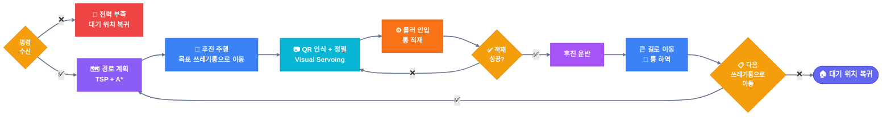
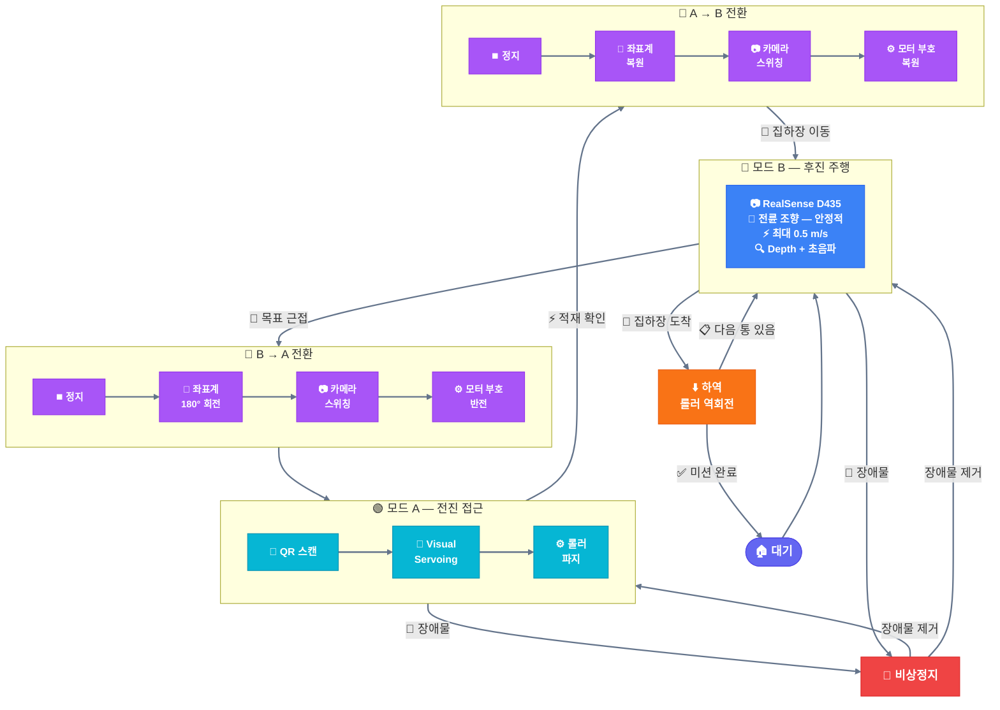
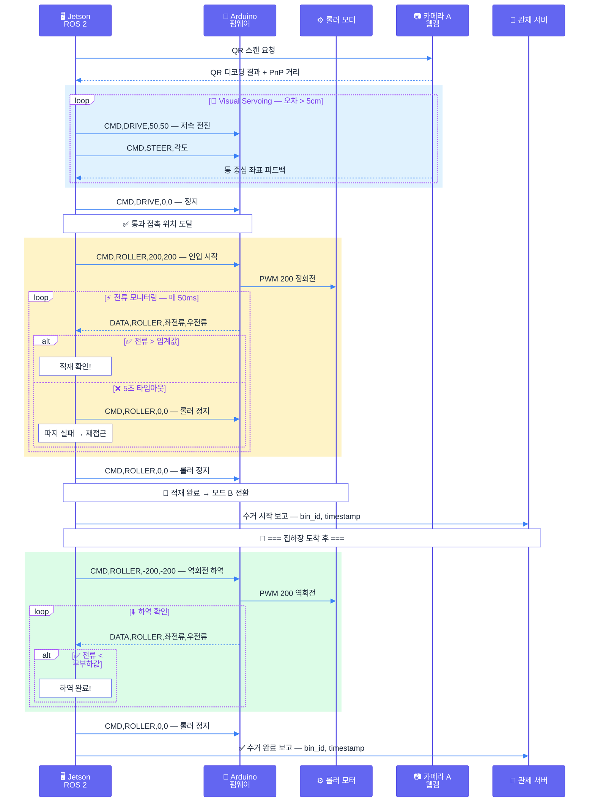
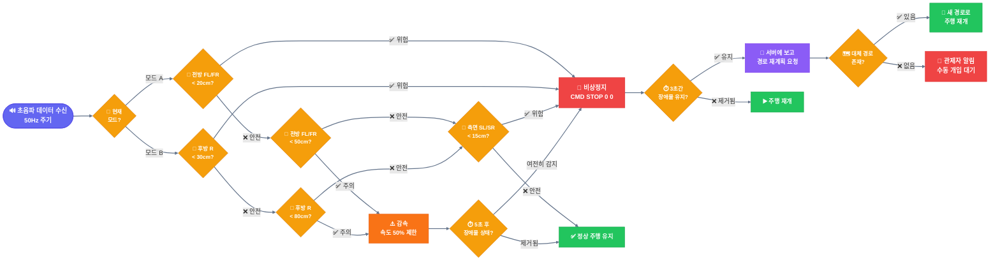
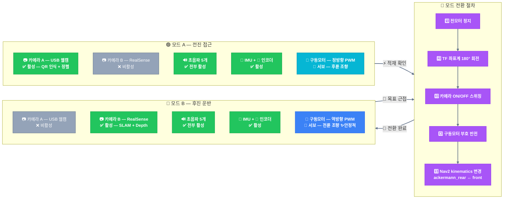
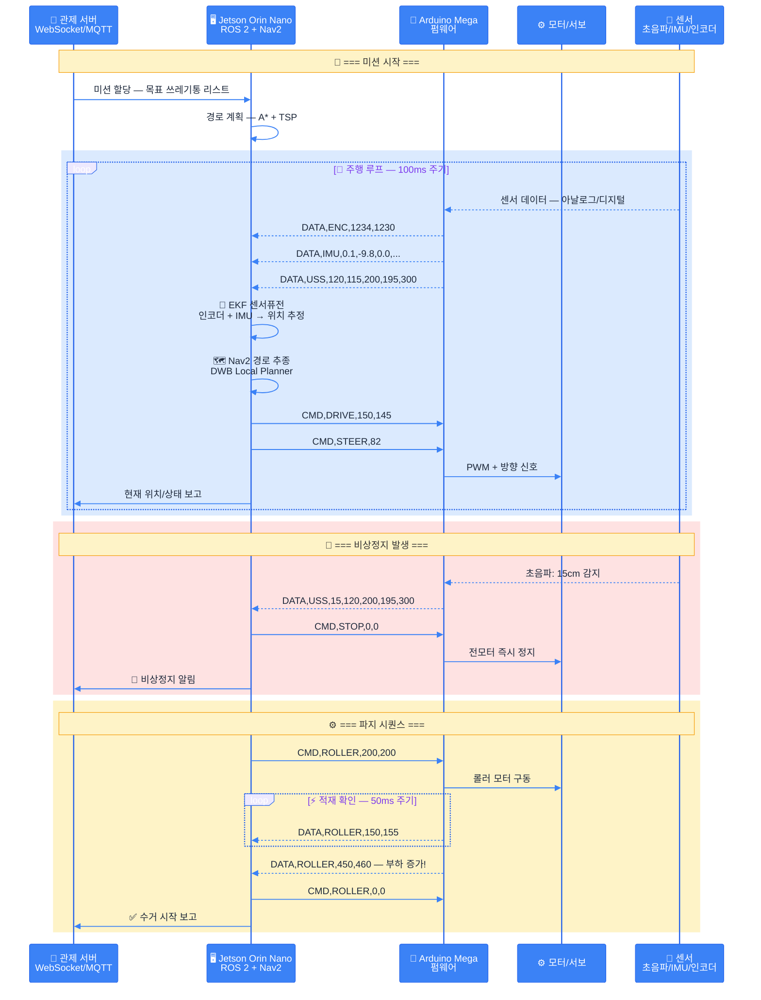

# 자율주행 음식물쓰레기통 수거 로봇 — 하드웨어 설계 명세서

> **프로젝트명**: AI+X 기계설계 — 자율주행 음식물쓰레기통 수거 로봇
> **대상 환경**: 한국 아파트 단지 내부 (포장도로)
> **수거 대상**: 3L 음식물쓰레기통
> **파지 방식**: 롤러 인입식 (경사 램프 + DC 롤러)
> **예산**: 테스트용 ~20만원 / 실전용 ~72만원
> **작성일**: 2026-03-14

---

## 목차

1. [로봇 구조 개요](#1-로봇-구조-개요)
2. [동작 시퀀스](#2-동작-시퀀스)
3. [서브시스템 상세](#3-서브시스템-상세)
4. [테스트용 BOM (3D 프린팅 Only)](#4-테스트용-bom)
5. [실전용 BOM](#5-실전용-bom)
6. [3D 프린팅 가이드](#6-3d-프린팅-가이드)
7. [배선도](#7-배선도)
8. [소프트웨어 모드 전환 설계](#8-소프트웨어-모드-전환-설계)
9. [미결정 항목 및 다음 단계](#9-미결정-항목-및-다음-단계)

---

이경석 천재
## 1. 로봇 구조 개요

### 1.1 전체 구조도 (위에서 본 모습)

```
              ※ 전진 방향 →

              [전방 — 파지부]
 초음파(FL)                        초음파(FR)
    ╲    롤러(DC)════════롤러(DC)    ╱
     ●━━━━━━━━━━━━━━━━━━━━━━━━━●      ← 구동바퀴 2개 (DC 기어모터)
     ┃                           ┃
     ┃   📷A (USB 웹캠)          ┃      ← 파지 카메라 (내측, 전방 시야)
 초음파┃     QR 인식 + 정렬        ┃초음파
 (SL) ┃                          ┃(SR)
     ┃     [적재 공간]            ┃
     ┃     (경사 램프)            ┃
     ┃                           ┃
     ┗━━━━━━━━━━●━━━━━━━━━━━━━━┛      ← 후륜: 서보 1개 (조향) + 바퀴 1개
                ┃
           📷B (RealSense D435)        ← 주행 카메라 (외측, 후방 시야)
                ┃
           초음파(R)
```

### 1.2 옆에서 본 모습

```
     롤러         적재 공간        서보 조향
      ║     ╱─────────────╲        │
      ║    ╱  경사 램프     ╲       │
      ║   ╱                 ╲      │
  ════●══╱═══════════════════╲═════●════
  구동바퀴                         조향바퀴
  (80mm)                          (80mm)

  📷A                              📷B
  (내측)                           (외측)
```

### 1.3 핵심 설계 원칙

| 원칙                           | 설명                                                   |
| ------------------------------ | ------------------------------------------------------ |
| **양방향 주행**                | 전진(접근) + 후진(운반) 두 모드로 운용                 |
| **전방=파지, 후방=네비게이션** | 카메라 역할 분리로 동시 처리 불필요                    |
| **롤러 인입식 파지**           | 양팔 그리퍼 대비 정렬 허용 오차 크고, 파지 실패율 낮음 |
| **3D 프린팅 우선**             | 프레임, 기어, 롤러, 마운트 전부 3D 프린팅 → 빠른 반복  |

### 1.4 두 가지 주행 모드

```
=== 모드 A: 전진 (쓰레기통 접근) ===

  진행 방향 →
  [롤러/파지부] ─── [본체] ─── [조향]
   📷A 활성                    후륜 조향 (저속, 단거리)


=== 모드 B: 후진 (통 싣고 이동) ===

                              ← 진행 방향
  [롤러+통] ─── [본체] ─── [조향]
                              📷B 활성
                              전륜 조향 (안정적, 장거리)
```

**핵심**: 장거리 이동(모드 B)에서 서보 조향이 **전륜 조향** 역할 → 자동차와 같은 안정적 주행

---

## 2. 동작 시퀀스

### 2.1 전체 미션 흐름

```
[1] 미션 수신
 │  관제 서버에서 "A동-5호 쓰레기통 수거" 명령
 │
 ▼
[2] 목표 근처까지 이동 (모드 B — 후진)
 │  • 카메라 B (RealSense) 활성 → SLAM + 장애물 감지
 │  • 서보 = 전륜 조향 → 안정적 장거리 주행
 │  • 초음파 5개 전방위 감시
 │
 ▼
[3] 방향 전환 → 통에 접근 (모드 A — 전진)
 │  • 카메라 A (웹캠) 활성 → QR 스캔 시작
 │  • 서보 = 후륜 조향 (저속, 수 미터)
 │
 ▼
[4] QR 인식 → 통 ID 확인
 │  • 카메라 A로 QR 코드 읽기
 │  • {"bin_id": "A동-5호", "type": "food_waste"} 확인
 │  • PnP로 거리/각도 추정 → 정밀 접근
 │
 ▼
[5] 정밀 접근 (Visual Servoing)
 │  • 카메라 A 피드백으로 통 중심 정렬
 │  • 오차 허용: ±5cm (롤러 인입이라 그리퍼보다 관대)
 │  • 접근 속도: 0.1 m/s 이하
 │
 ▼
[6] 롤러 파지
 │  • 롤러가 통 양쪽에 접촉
 │  • DC 모터 회전 → 통이 경사 램프를 타고 올라옴
 │  • 전류 모니터링 → 적재 확인
 │
 ▼
[7] 통 싣고 집하장 이동 (모드 B — 후진)
 │  • 카메라 B 활성 → 네비게이션
 │  • 서보 = 전륜 조향 → 안정적
 │
 ▼
[8] 집하장 도착 → 통 하역
 │  • 롤러 역회전 → 통이 경사 램프를 타고 내려옴
 │  • 또는 전진하여 통을 뒤로 미끄러뜨림
 │
 ▼
[9] 상태 보고 → 다음 미션 대기
    • 서버에 "수거 완료" 전송
    • 배터리 잔량 확인 → 부족 시 충전소 복귀
```

### 2.2 롤러 파지 상세

```
[접근]              [접촉]              [인입 완료]

  통                  통
  ┃    →로봇→         ┃                  [통 적재됨]
  ┃                 롤러╋롤러             롤러╋롤러
  ┃               ╱    ┃    ╲         ╱    ┃    ╲
─────         ═══╱═════╋═════╲═══  ═══╱════════════╲═══
              경사램프  ┃            경사램프
                       ▲
                   롤러 회전으로
                   통이 올라옴
```

**롤러 동작 원리**:

1. 롤러 2개가 통 양쪽에 접촉 (간격은 3L 통 폭에 맞춤)
2. DC 모터로 롤러 회전 → 마찰력으로 통을 끌어당김
3. 경사 램프(15~20도)를 따라 통이 본체 위로 올라옴
4. 적재 위치에 도달하면 롤러 정지
5. 하역 시: 롤러 역회전 또는 중력으로 미끄러져 내려옴

**롤러 사양**:

- 지름: 30~40mm
- 재질: 3D 프린팅 코어 + 실리콘/고무 튜브 (마찰력 확보)
- 간격: 통 폭 + 양쪽 5mm 여유 (약 150~180mm 조절 가능)
- 회전 속도: 30~60 RPM (너무 빠르면 통이 튐)

---

## 3. 서브시스템 상세

### 3.1 구동부 (Drive System)

| 항목              | 사양                                                  |
| ----------------- | ----------------------------------------------------- |
| **방식**          | 전륜 2륜 구동 + 후륜 서보 조향                        |
| **구동 모터**     | JGB37-520 DC 기어모터 x2 (인코더 내장, 홀 센서 11PPR) |
| **감속비**        | 1:30 권장 (무부하 200RPM → 주행 속도 ~0.5m/s)         |
| **구동 전압**     | 12V                                                   |
| **모터 드라이버** | L298N x1 (2채널 — 좌/우 모터)                         |
| **바퀴**          | 80mm 고무 타이어 (포장도로 + 인터로킹 대응)           |
| **조향 서보**     | MG996R x1 (토크 13kg.cm, 조향에 충분)                 |
| **조향 바퀴**     | 80mm (구동 바퀴와 동일 지름)                          |
| **조향 각도**     | ±30도 (아파트 통로 회전반경 대응)                     |

**오도메트리 계산**:

```
바퀴 둘레 = π × 80mm = 251.3mm
인코더 분해능 = 11 PPR × 30 (감속비) = 330 펄스/회전
1펄스 = 251.3mm / 330 = 0.76mm 분해능
```

### 3.2 파지부 (Roller Intake System)

| 항목               | 사양                                          |
| ------------------ | --------------------------------------------- |
| **방식**           | 양쪽 롤러 + 경사 램프 인입                    |
| **롤러 모터**      | DC 모터 (소형) x2 — 좌/우 롤러 각각           |
| **롤러 드라이버**  | L298N x1 (2채널 — 좌/우 롤러)                 |
| **롤러 지름**      | 30~40mm (3D 프린팅 + 고무 튜브)               |
| **롤러 간격**      | ~170mm (3L 통 폭 기준, 조절 가능)             |
| **경사 램프 각도** | 15~20도                                       |
| **적재 확인**      | 롤러 모터 전류 모니터링 (부하 증가 = 통 적재) |

### 3.3 센서부 (Perception)

| 센서                       | 수량 | 위치              | 역할                                         |
| -------------------------- | ---- | ----------------- | -------------------------------------------- |
| **RealSense D435** (RGB-D) | 1    | 후면 외측         | SLAM, 장애물 감지, 경로 추적, 후진 주행 시야 |
| **USB 웹캠** (1080p)       | 1    | 후면 내측         | QR 인식, 통 위치 파악, Visual Servoing       |
| **MPU-9250** (9축 IMU)     | 1    | 본체 중앙         | 자세 감지, EKF 센서퓨전                      |
| **HC-SR04 초음파**         | 5    | 전방2+측면2+후방1 | 비상정지, 근접 장애물 감지                   |

**카메라 역할 분담 정리**:

|                     | 카메라 A (USB 웹캠)        | 카메라 B (RealSense D435)             |
| ------------------- | -------------------------- | ------------------------------------- |
| **위치**            | 후면 판 내측 (파지쪽 향함) | 후면 판 외측 (바깥 향함)              |
| **활성 모드**       | 모드 A (전진/접근)         | 모드 B (후진/운반)                    |
| **QR 인식**         | O                          | X (불필요)                            |
| **Visual Servoing** | O (통 정렬)                | X                                     |
| **SLAM**            | X                          | O                                     |
| **Depth**           | X (RGB만)                  | O (스테레오 depth)                    |
| **장애물 감지**     | X (초음파가 담당)          | O (depth 포인트클라우드)              |
| **해상도**          | 1080p @ 30fps              | 1280x720 RGB + 1280x720 Depth @ 30fps |
| **비용**            | ~2만원                     | ~15만원                               |

**초음파 센서 배치**:

| 위치         | 감지 방향      | 비상정지 거리 | 감속 거리 |
| ------------ | -------------- | ------------- | --------- |
| 전방 좌 (FL) | 전방+좌측 45도 | 20cm          | 50cm      |
| 전방 우 (FR) | 전방+우측 45도 | 20cm          | 50cm      |
| 측면 좌 (SL) | 좌측 90도      | 15cm          | 30cm      |
| 측면 우 (SR) | 우측 90도      | 15cm          | 30cm      |
| 후방 (R)     | 후방 180도     | 30cm          | 80cm      |

### 3.4 컴퓨팅 (Compute)

| 항목              | 사양                                       |
| ----------------- | ------------------------------------------ |
| **메인 컴퓨터**   | NVIDIA Jetson Orin Nano 8GB                |
| **OS**            | Ubuntu 22.04 + JetPack 6.x                 |
| **미들웨어**      | ROS 2 Humble                               |
| **AI 추론**       | TensorRT (YOLO FP16)                       |
| **저수준 제어기** | Arduino Mega 2560                          |
| **통신**          | Jetson ↔ Arduino: USB 시리얼 (115200 baud) |

### 3.5 전원 (Power)

| 항목               | 사양                         | 비고                     |
| ------------------ | ---------------------------- | ------------------------ |
| **메인 배터리**    | 12V 5000mAh LiPo 3S          | 전체 시스템 전원         |
| **Jetson 전원**    | 5V 4A UBEC (12V→5V)          | 배터리에서 변환          |
| **서보 전원**      | 6V BEC (12V→6V)              | **반드시 Jetson과 분리** |
| **비상 스위치**    | 물리 킬스위치 (빨간 버튼)    | 전원 일괄 차단           |
| **예상 운용 시간** | ~2시간 (주행 + AI 추론 기준) |                          |

**전원 분리가 중요한 이유**:
서보/모터 동작 시 순간적으로 큰 전류가 흐름 → 전압 드롭 발생 → Jetson이 리셋될 수 있음. UBEC/BEC로 분리하면 이 문제 방지.

---

## 4. 테스트용 BOM

> **목적**: 모터 없이 3D 프린팅만으로 물리적 구조, 기어 맞물림, 조향 메커니즘, 롤러 인입을 검증
> **목표**: "이 구조로 실제 동작이 가능한가?" 확인

### 4.1 테스트용 부품 목록

| #   | 부품                        | 수량       | 단가(만원) | 소계         | 제작 방식 | 비고                  |
| --- | --------------------------- | ---------- | ---------- | ------------ | --------- | --------------------- |
| 1   | PETG 필라멘트               | 2kg        | 2          | 4            | 구매      | 프레임+기어+롤러 전부 |
| 2   | PLA 필라멘트                | 0.5kg      | 1          | 1            | 구매      | 시제품 빠른 출력용    |
| 3   | 608 베어링 (스케이트보드용) | 10개       | 0.3        | 0.3          | 구매      | 바퀴축, 롤러축        |
| 4   | M3/M4 볼트너트 세트         | 1세트      | 0.5        | 0.5          | 구매      | 조립용                |
| 5   | 8mm 스테인리스 샤프트       | 3개 (30cm) | 0.5        | 0.5          | 구매      | 바퀴축, 롤러축        |
| 6   | 실리콘 튜브 (내경 30mm)     | 50cm       | 0.3        | 0.3          | 구매      | 롤러 고무 코팅 대용   |
| 7   | 고무밴드 (대형)             | 10개       | 0.1        | 0.1          | 구매      | 바퀴 타이어 대용      |
| 8   | 3L 음식물쓰레기통 (실물)    | 2개        | 0.5        | 1            | 구매      | 파지 테스트용         |
|     |                             |            | **합계**   | **~7.7만원** |           |                       |

### 4.2 테스트용 3D 프린팅 부품 목록

| 부품                     | 개수   | 예상 출력 시간 | 소재 | 검증 목적               |
| ------------------------ | ------ | -------------- | ---- | ----------------------- |
| **메인 프레임 (상판)**   | 1      | 8~10시간       | PETG | 부품 배치, 강성         |
| **메인 프레임 (하판)**   | 1      | 6~8시간        | PETG | 경사 램프 포함          |
| **전륜 허브 (좌)**       | 1      | 2시간          | PETG | 모터 마운트 형상        |
| **전륜 허브 (우)**       | 1      | 2시간          | PETG | 모터 마운트 형상        |
| **후륜 조향 어셈블리**   | 1      | 3시간          | PETG | 서보 마운트 + 킹핀 구조 |
| **바퀴 (80mm)**          | 3      | 각 1.5시간     | PETG | 구름 테스트             |
| **롤러 (40mm x 100mm)**  | 2      | 각 1시간       | PETG | 인입 동작 테스트        |
| **롤러 마운트 브래킷**   | 2      | 각 1시간       | PETG | 정렬 확인               |
| **경사 램프**            | 1      | 3시간          | PETG | 통 인입 각도 테스트     |
| **카메라 마운트 (내측)** | 1      | 0.5시간        | PLA  | 시야각 확인             |
| **카메라 마운트 (외측)** | 1      | 0.5시간        | PLA  | 시야각 확인             |
| **초음파 센서 마운트**   | 5      | 각 0.3시간     | PLA  | 배치 확인               |
|                          | **총** | **~35시간**    |      |                         |

### 4.3 테스트용에서 검증할 것

| #   | 검증 항목         | 방법                          | 합격 기준                          |
| --- | ----------------- | ----------------------------- | ---------------------------------- |
| 1   | **조향 메커니즘** | 서보 자리에 손으로 회전       | ±30도 부드럽게 회전, 유격 1mm 이하 |
| 2   | **롤러 인입**     | 손으로 롤러 돌려서 통 올림    | 3L 통이 경사 램프를 타고 올라옴    |
| 3   | **적재 안정성**   | 통 올린 상태로 기울이기       | 20도 기울여도 통이 미끄러지지 않음 |
| 4   | **프레임 강성**   | 통(만통 ~3kg) 적재            | 프레임 휨 2mm 이하                 |
| 5   | **바퀴 구름**     | 평지에서 밀기                 | 직진성 유지, 좌우 틀어짐 5도 이하  |
| 6   | **카메라 시야**   | 스마트폰을 카메라 위치에 장착 | QR코드(1m 거리)가 화면에 잡힘      |
| 7   | **전체 치수**     | 3L 통 2개 나란히 놓고 비교    | 로봇이 통보다 과도하게 크지 않음   |
| 8   | **무게 분배**     | 통 적재 전/후 무게중심        | 적재 후에도 후륜이 들리지 않음     |

### 4.4 테스트용에서 **없는 것** (의도적 제외)

| 제외 항목                  | 이유                                        |
| -------------------------- | ------------------------------------------- |
| DC 모터                    | 물리 구조 검증만 목적, 구동 불필요          |
| 서보 모터                  | 손으로 조향 테스트 충분                     |
| Jetson / Arduino           | 소프트웨어는 웹 시뮬레이션에서 이미 검증    |
| 배터리 / 전원부            | 전자부품 전부 제외                          |
| 센서 (카메라, IMU, 초음파) | 마운트 위치만 확인, 실제 센서는 실전용에서  |
| 배선                       | 배선 경로는 프레임에 케이블 가이드로만 표시 |

---

## 5. 실전용 BOM

> **목적**: 실제 자율주행 + 파지가 가능한 완전체
> **테스트용에서 검증된 프레임 구조를 그대로 사용 + 전자부품 추가**

### 5.1 실전용 부품 목록

| #   | 카테고리      | 부품                              | 수량 | 단가(만원) | 소계        | 비고                               |
| --- | ------------- | --------------------------------- | ---- | ---------- | ----------- | ---------------------------------- |
|     | **컴퓨팅**    |                                   |      |            |             |                                    |
| 1   | 메인 컴퓨터   | Jetson Orin Nano 8GB              | 1    | 35         | 35          | GPU 1024 CUDA, 8GB RAM             |
| 2   | 저수준 제어기 | Arduino Mega 2560                 | 1    | 1.5        | 1.5         | 모터/서보/센서 제어                |
|     | **카메라**    |                                   |      |            |             |                                    |
| 3   | 주행 카메라   | Intel RealSense D435              | 1    | 15         | 15          | 후면 외측, SLAM+depth              |
| 4   | 파지 카메라   | USB 웹캠 1080p                    | 1    | 2          | 2           | 후면 내측, QR+정렬                 |
|     | **센서**      |                                   |      |            |             |                                    |
| 5   | IMU           | MPU-9250 (9축)                    | 1    | 0.5        | 0.5         | EKF 센서퓨전                       |
| 6   | 초음파        | HC-SR04                           | 5    | 0.1        | 0.5         | 비상정지/근접감지                  |
|     | **구동**      |                                   |      |            |             |                                    |
| 7   | 구동 모터     | JGB37-520 기어모터 (인코더, 1:30) | 2    | 1.5        | 3           | 전륜 구동                          |
| 8   | 롤러 모터     | DC 모터 (소형, ~12V)              | 2    | 0.5        | 1           | 좌/우 롤러                         |
| 9   | 조향 서보     | MG996R                            | 1    | 0.5        | 0.5         | 후륜 조향                          |
| 10  | 모터 드라이버 | L298N                             | 2    | 0.3        | 0.6         | 구동모터용 1개 + 롤러용 1개        |
|     | **구조**      |                                   |      |            |             |                                    |
| 11  | 구동 바퀴     | 80mm 고무 타이어                  | 2    | 0.5        | 1           | 전륜                               |
| 12  | 조향 바퀴     | 80mm 고무 타이어                  | 1    | 0.5        | 0.5         | 후륜                               |
| 13  | 프레임        | 3D 프린팅 (PETG 2kg)              | -    | 2          | 4           | 테스트용 프레임 재활용 또는 재출력 |
| 14  | 롤러          | 3D 프린팅 + 실리콘 튜브           | 2    | 0.3        | 0.3         | 마찰력 확보                        |
| 15  | 베어링        | 608 베어링                        | 10   | 0.3        | 0.3         | 바퀴축, 롤러축                     |
| 16  | 샤프트        | 8mm 스테인리스                    | 3    | 0.5        | 0.5         | 축                                 |
|     | **전원**      |                                   |      |            |             |                                    |
| 17  | 배터리        | 12V 5000mAh LiPo 3S               | 1    | 4          | 4           | 메인 전원                          |
| 18  | Jetson 전원   | 5V 4A UBEC                        | 1    | 0.5        | 0.5         | 12V→5V 변환                        |
| 19  | 서보 전원     | 6V BEC                            | 1    | 0.5        | 0.5         | 12V→6V, 별도 분리                  |
| 20  | 비상 스위치   | 킬스위치 (빨간 버튼)              | 1    | 0.3        | 0.3         | 물리적 전원 차단                   |
|     | **기타**      |                                   |      |            |             |                                    |
| 21  | 배선          | 점퍼선, 커넥터, 수축튜브          | -    | 1          | 1           |                                    |
| 22  | 나사류        | M3/M4 볼트너트 세트               | 1    | 0.5        | 0.5         |                                    |
|     |               |                                   |      | **합계**   | **~72만원** |                                    |

### 5.2 테스트용 → 실전용 전환 시 변경점

| 항목     | 테스트용             | 실전용                         | 변경 내용                     |
| -------- | -------------------- | ------------------------------ | ----------------------------- |
| 프레임   | 그대로 사용          | 그대로 사용 (또는 보강 재출력) | 테스트에서 약한 부분 보강     |
| 바퀴     | 3D 프린팅 + 고무밴드 | 기성품 80mm 고무 타이어        | 교체                          |
| 구동축   | 수동 (손으로 밀기)   | JGB37-520 모터 장착            | 모터 마운트에 끼우기          |
| 조향     | 수동 (손으로 돌림)   | MG996R 서보 장착               | 서보 마운트에 끼우기          |
| 롤러     | 수동 (손으로 돌림)   | DC 모터 연결                   | 커플링/기어 추가              |
| 전자부품 | 없음                 | 전부 추가                      | Jetson, Arduino, 센서, 배터리 |

**핵심**: 프레임은 **한 번만 설계/출력**하고, 테스트 후 모터/전자부품만 장착하면 실전용이 됨.

---

## 6. 3D 프린팅 가이드

### 6.1 출력 설정 권장

| 항목            | 프레임/구조물 | 기어/롤러 | 마운트/브래킷 |
| --------------- | ------------- | --------- | ------------- |
| **소재**        | PETG          | PETG      | PLA (가능)    |
| **노즐 온도**   | 235°C         | 235°C     | 210°C         |
| **베드 온도**   | 80°C          | 80°C      | 60°C          |
| **레이어 높이** | 0.2mm         | 0.15mm    | 0.2mm         |
| **인필**        | 40~50%        | 80~100%   | 30%           |
| **벽 두께**     | 3~4겹         | 4겹       | 2~3겹         |
| **서포트**      | 최소화 설계   | 필요 시   | 필요 시       |

**PETG를 쓰는 이유**:

- PLA보다 충격 강도 2~3배 (떨어뜨려도 안 깨짐)
- 내열성 높음 (여름 야외 사용 가능, PLA는 60도에서 변형)
- 기어/롤러 마모에 강함

### 6.2 설계 시 주의사항

| 항목              | 가이드                                                    |
| ----------------- | --------------------------------------------------------- |
| **공차**          | 축-구멍: +0.2~0.3mm (예: 8mm 샤프트 → 구멍 8.3mm)         |
| **벽 최소 두께**  | 2mm 이상 (1.5mm 이하는 깨짐 위험)                         |
| **볼트 구멍**     | M3 → 3.3mm, M4 → 4.3mm (나사산 여유)                      |
| **베어링 자리**   | 608 베어링 외경 22mm → 구멍 22.1mm (압입)                 |
| **분할 출력**     | 프레임이 프린터 베드(220x220mm)보다 크면 분할 + 볼트 체결 |
| **케이블 가이드** | 프레임에 10mm 폭 채널을 설계해서 배선 정리                |

### 6.3 롤러 제작 방법

```
[롤러 단면]

    ┌─ 실리콘 튜브 (외경 40mm, 내경 30mm)
    │
    │  ┌─ 3D 프린팅 코어 (외경 30mm)
    │  │
    │  │  ┌─ 608 베어링 (내경 8mm)
    │  │  │
  ──╫──╫──●── 8mm 샤프트
    │  │  │
    │  │  └─
    │  └─
    └─
```

1. PETG로 코어 출력 (외경 30mm, 중공, 양쪽 베어링 자리)
2. 608 베어링 2개 압입
3. 실리콘 튜브를 코어 위에 씌움 (마찰력 확보)
4. 8mm 샤프트 관통

---

## 7. 배선도

### 7.1 시스템 배선 개요

```
┌─────────────────────────────────────────────────────┐
│                    12V LiPo 배터리                     │
│                         │                             │
│              ┌──────────┼──────────┐                  │
│              │          │          │                  │
│          [킬스위치]     │          │                  │
│              │          │          │                  │
│         ┌────┴────┐ ┌───┴───┐ ┌───┴───┐              │
│         │  5V UBEC │ │6V BEC │ │ 12V   │              │
│         └────┬────┘ └───┬───┘ └───┬───┘              │
│              │          │         │                   │
│         [Jetson]   [서보MG996R]  [L298N x2]           │
│          Orin Nano                │                   │
│              │                ┌───┴────┐              │
│         USB  │           [DC모터x2] [DC모터x2]        │
│         ┌────┤            구동        롤러             │
│    [RealSense] [USB웹캠]                              │
│                                                       │
│         [Jetson] ← USB Serial → [Arduino Mega]        │
│                                      │                │
│                              ┌───────┼───────┐       │
│                          [IMU]  [초음파x5] [인코더x2]  │
│                          I2C    GPIO       GPIO       │
└─────────────────────────────────────────────────────┘
```

### 7.2 Arduino Mega 핀 배치

| 핀          | 연결             | 용도                  |
| ----------- | ---------------- | --------------------- |
| D2          | 좌 모터 인코더 A | 인터럽트 (오도메트리) |
| D3          | 좌 모터 인코더 B | 인터럽트              |
| D18         | 우 모터 인코더 A | 인터럽트              |
| D19         | 우 모터 인코더 B | 인터럽트              |
| D5 (PWM)    | L298N #1 ENA     | 좌 구동모터 속도      |
| D6 (PWM)    | L298N #1 ENB     | 우 구동모터 속도      |
| D7, D8      | L298N #1 IN1-IN2 | 좌 구동모터 방향      |
| D9, D10     | L298N #1 IN3-IN4 | 우 구동모터 방향      |
| D11 (PWM)   | L298N #2 ENA     | 좌 롤러모터 속도      |
| D12 (PWM)   | L298N #2 ENB     | 우 롤러모터 속도      |
| D22, D23    | L298N #2 IN1-IN2 | 좌 롤러 방향          |
| D24, D25    | L298N #2 IN3-IN4 | 우 롤러 방향          |
| D44 (Servo) | MG996R 서보      | 조향                  |
| D26~D30     | HC-SR04 Trig x5  | 초음파 트리거         |
| D31~D35     | HC-SR04 Echo x5  | 초음파 에코           |
| SDA/SCL     | MPU-9250         | IMU I2C               |
| A0          | 전압 분배기      | 배터리 전압 모니터링  |

### 7.3 Jetson ↔ Arduino 통신 프로토콜

```
# Jetson → Arduino (명령)
CMD,<type>,<value1>,<value2>\n

예시:
CMD,DRIVE,150,-150      # 좌 PWM=150, 우 PWM=-150 (제자리 회전)
CMD,STEER,75            # 서보 각도 75도
CMD,ROLLER,200,200      # 롤러 PWM 200 (인입)
CMD,ROLLER,-200,-200    # 롤러 역회전 (하역)
CMD,STOP,0,0            # 긴급 정지

# Arduino → Jetson (센서 데이터, 50Hz)
DATA,ENC,<left_ticks>,<right_ticks>
DATA,IMU,<ax>,<ay>,<az>,<gx>,<gy>,<gz>
DATA,USS,<fl>,<fr>,<sl>,<sr>,<r>     # 초음파 5개 거리(cm)
DATA,BAT,<voltage>
DATA,ROLLER,<left_current>,<right_current>
```

---

## 8. 소프트웨어 모드 전환 설계

### 8.1 두 가지 모드의 좌표계

```
=== 모드 A (전진/접근) ===

  X축(전방) →
  ↑ Y축(좌측)

  base_link 원점: 로봇 중심
  전방(X+) = 롤러/파지부 방향
  카메라 A 활성, 카메라 B 비활성


=== 모드 B (후진/운반) ===

                ← X축(전방)
                   Y축(좌측) ↑

  base_link 원점: 로봇 중심 (동일)
  전방(X+) = 서보 조향 방향 (물리적 후방)
  카메라 B 활성, 카메라 A 비활성
```

### 8.2 모드 전환 시 변경되는 것

| 항목                | 모드 A (전진)              | 모드 B (후진)               |
| ------------------- | -------------------------- | --------------------------- |
| `base_link` 전방    | 롤러쪽 (0도)               | 서보쪽 (180도 회전)         |
| 활성 카메라         | 카메라 A (웹캠)            | 카메라 B (RealSense)        |
| Nav2 kinematics     | 후륜 조향 (ackermann_rear) | 전륜 조향 (ackermann_front) |
| 구동 모터 방향      | 정방향                     | 역방향 (코드에서 부호 반전) |
| 조향 서보 방향      | 반전                       | 정방향                      |
| costmap 장애물 소스 | 초음파만                   | RealSense depth + 초음파    |
| 최대 속도           | 0.2 m/s (저속)             | 0.5 m/s                     |

### 8.3 모드 전환 트리거

```
미션 시작 → 모드 B로 출발 → 목표 근처 도착
→ [트리거: 목표까지 거리 < 3m]
→ 정지 → 모드 A로 전환 → 전진 접근/파지
→ 파지 완료
→ [트리거: 롤러 전류 > 임계값 (통 적재 확인)]
→ 모드 B로 전환 → 집하장 이동
```

---

## 9. 미결정 항목 및 다음 단계

### 9.1 미결정 항목

| #   | 항목                    | 결정 필요 내용                   | 영향                                  |
| --- | ----------------------- | -------------------------------- | ------------------------------------- |
| 1   | **로봇 전체 치수**      | 가로 × 세로 × 높이 (mm)          | 프레임 3D 모델링 시작 조건            |
| 2   | **3L 통 정확한 규격**   | 직경 × 높이 × 무게 (빈통/만통)   | 롤러 간격, 경사 램프 각도 결정        |
| 3   | **경사 램프 각도**      | 15도? 20도?                      | 인입 용이성 vs 로봇 높이 트레이드오프 |
| 4   | **롤러-모터 연결 방식** | 직결? 기어? 벨트?                | 토크 전달 효율                        |
| 5   | **조향 메커니즘 상세**  | 서보 → 바퀴 연결 (직결? 링크?)   | 3D 모델링 필요                        |
| 6   | **아파트 단지 도면**    | 시뮬레이션 맵 + 실환경 SLAM 기반 | 경로 계획 테스트                      |
| 7   | **3D 프린터 기종**      | 베드 크기, 정밀도 확인           | 분할 출력 계획                        |

### 9.2 다음 단계 로드맵

```
[현재] 설계 확정 + 웹 테스트 플랫폼 완성
  │
  ▼
[Step 1] 테스트용 3D 프린팅 (1~2주)
  │  • 프레임 3D 모델링 (Fusion 360 / OnShape)
  │  • 출력 + 조립
  │  • 손으로 조향/롤러/인입 테스트
  │
  ▼
[Step 2] 테스트 결과 반영 → 설계 수정 (3~5일)
  │  • 약한 부분 보강
  │  • 공차/치수 조정
  │  • 필요시 재출력
  │
  ▼
[Step 3] 실전 부품 구매 + 조립 (1~2주)
  │  • 전자부품 주문 (Jetson, 모터, 센서 등)
  │  • 테스트용 프레임에 전자부품 장착
  │  • Arduino 펌웨어 작성 (모터 제어 + 시리얼 통신)
  │
  ▼
[Step 4] 소프트웨어 통합 (2~3주)
  │  • 웹 테스트 → ROS 2 전환
  │  • 카메라 드라이버 연동
  │  • SLAM + Nav2 설정
  │  • 실환경 매핑/테스트
  │
  ▼
[Step 5] 통합 테스트 + 튜닝 (2~3주)
     • 접근 → QR 인식 → 파지 → 운반 전체 시나리오
     • Nav2 파라미터 튜닝
     • 안전 시스템 (비상정지) 검증
```

---

## 10. 작동 알고리즘 다이어그램 (Mermaid)

### 10.1 전체 미션 흐름



### 10.2 모드 전환 상태 다이어그램



### 10.3 롤러 파지 시퀀스



### 10.4 비상정지 로직



### 10.5 센서/카메라 활성화 맵



### 10.6 Jetson ↔ Arduino 통신 흐름


